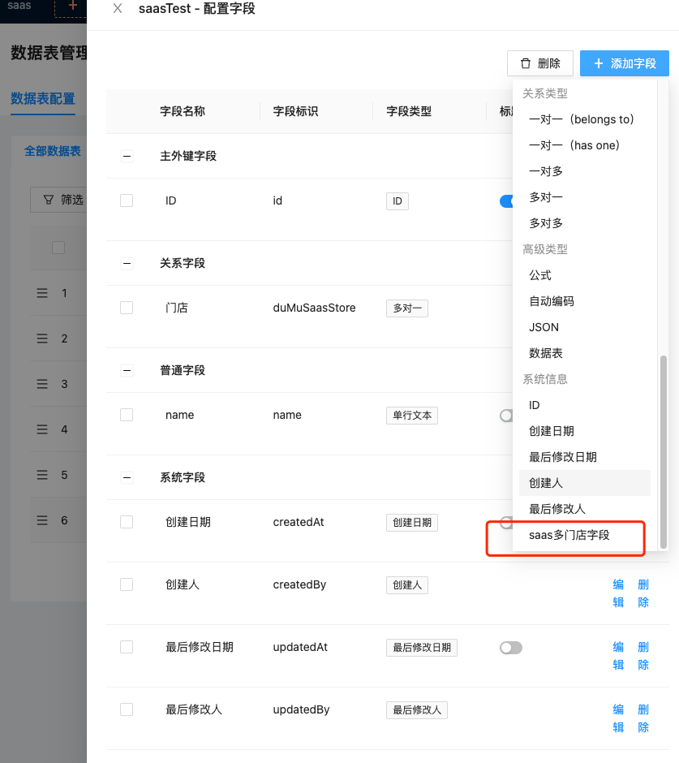
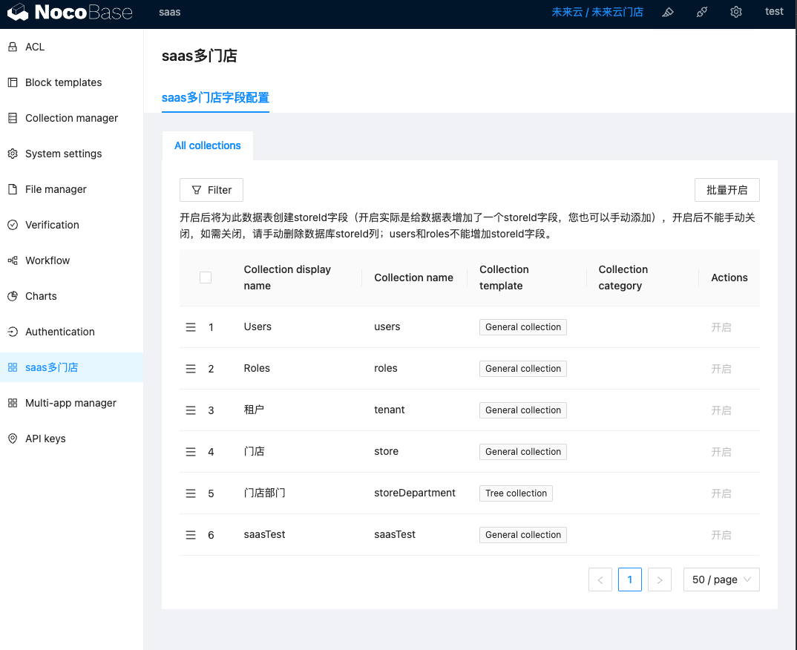
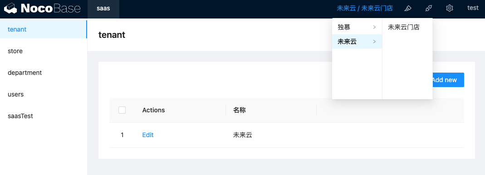
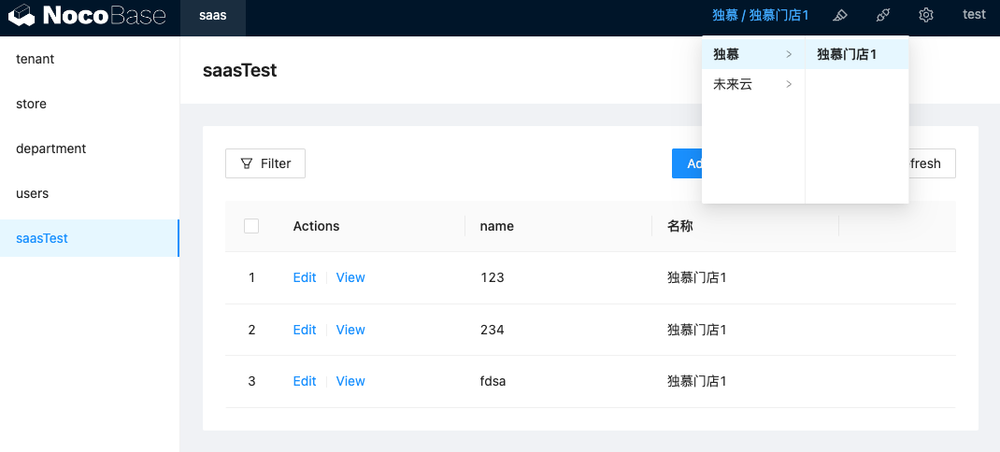

# SAAS 多门店插件

对数据表开启saas多门店后会自动创建一个多门店字段
门店中的用户增加数据会对数据自动带上门店id、删改查都会校验门店id

### 注册安装

``` shell
cd packages/plugins
git clone git@github.com:nocobase-dumu-plugins/dumu-saas-store.git
yarn pm add dumu-saas-store
yarn pm enable dumu-saas-store (可不执行，再插件管理中开启)
```
### 使用说明
。。。




